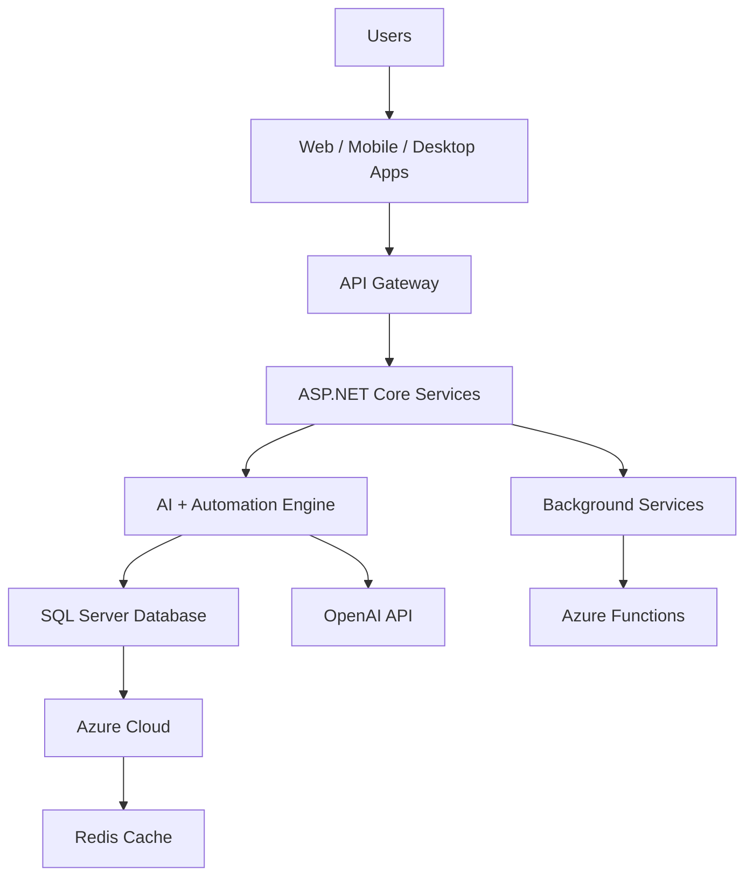

# GRT Assist Nexus Platform

## Description
GRT Assist Nexus is a powerful unified platform designed for Grt Assist Automation and Security Pvt. Ltd., providing Web + Mobile + Desktop + API + AI + Automation + Data access + Azure + SQL Server connectivity. This platform serves as a nexus connecting APIs, users, services, and data for global multi-service operations.

## Features
- **Web Application**: Full-featured web interface
- **Mobile Application**: Cross-platform mobile access
- **Desktop Application**: Native desktop experience
- **Admin Panel**: Comprehensive administration tools
- **API Access**: RESTful API endpoints
- **Public Share Link**: Secure link sharing functionality
- **Automation Workflows**: Background automation services
- **AI Chatbot**: Intelligent conversational interface
- **Suggestion Engine**: AI-powered recommendations
- **Data Access Marketplace**: Centralized data marketplace
- **Secure Authentication**: Robust identity and access management
- **Azure Cloud Deployment**: Scalable cloud infrastructure

## Technology Stack
### Frontend
- React.js
- ASP.NET Razor Pages

### Backend
- ASP.NET Core Web API (.NET 10.0)
- Entity Framework Core
- SQL Server

### Database
- SQL Server
- Redis Cache

### Cloud
- Microsoft Azure
- Azure App Service
- Azure SQL Database
- Azure Functions
- Azure AI (OpenAI)

### AI
- Azure OpenAI API
- GPT-4 Integration

### Automation
- Hangfire Background Jobs
- Azure Functions

### Payment
- Stripe Integration

## Database Schema
The platform uses a comprehensive SQL Server database with the following main tables:
- Users, Roles, Permissions
- ApiKeys, AutomationJobs, AIRequests
- Payments, Transactions
- MarketData, SEOKeywords, SearchLogs
- Notifications, HistoryLogs, SystemLogs

## Getting Started

### Prerequisites
- .NET 10.0 SDK
- SQL Server
- Azure Subscription (for cloud deployment)
- Stripe Account (for payments)
- Azure OpenAI Service (for AI features)

### Installation

1. Clone the repository
```bash
git clone https://github.com/your-org/grt.automation.net.git
cd grt.automation.net
```

2. Update configuration in `appsettings.json`
```json
{
  "ConnectionStrings": {
    "DefaultConnection": "Server=your-server;Database=GRTAssistNexus;Trusted_Connection=True;MultipleActiveResultSets=true;TrustServerCertificate=True"
  },
  "Jwt": {
    "Key": "YourSuperSecretKeyHere",
    "Issuer": "GRTAssistNexus",
    "Audience": "GRTAssistNexusUsers"
  },
  "AzureOpenAI": {
    "Endpoint": "https://your-openai-endpoint.openai.azure.com/",
    "Key": "your-openai-key",
    "DeploymentName": "gpt-4"
  },
  "Stripe": {
    "SecretKey": "sk_test_your_stripe_secret_key",
    "PublishableKey": "pk_test_your_stripe_publishable_key"
  }
}
```

3. Run database migrations
```bash
cd src/GRTAssist.API
dotnet ef database update
```

4. Run the application
```bash
dotnet run
```

### API Endpoints

#### Authentication
- `POST /api/auth/register` - User registration
- `POST /api/auth/login` - User login
- `GET /api/auth/me` - Get current user

#### Automation
- `POST /api/automation` - Create automation job
- `GET /api/automation` - Get user jobs
- `POST /api/automation/{id}/execute` - Execute job

#### AI
- `POST /api/ai/chat` - AI chat
- `POST /api/ai/suggestions/automation` - Get automation suggestions
- `POST /api/ai/suggestions/seo` - Get SEO suggestions

#### Payments
- `POST /api/payment/create-intent` - Create payment intent
- `GET /api/payment/history` - Get payment history

## Deployment

### Azure Deployment
1. Create Azure App Service
2. Configure Azure SQL Database
3. Set up Azure OpenAI Service
4. Configure environment variables
5. Deploy using Azure DevOps or GitHub Actions

## Architecture Overview

```
Users
 │
 Web / Mobile / Desktop
  │
  Frontend (React / ASP.NET UI)
   │
   API Gateway
    │
    ASP.NET Core Backend
     │
     Automation Engine
      │
      AI Engine
       │
       Payment Gateway
        │
        SQL Server Database
         │
         Azure Cloud Infrastructure
```

## Security Features
- JWT Authentication
- Role-based Access Control
- API Key Management
- Encryption
- Security Logging
- Firewall Rules

## Contributing
Please read CONTRIBUTING.md for details on our code of conduct and the process for submitting pull requests.

## License
This project is proprietary software owned by Grt Assist Automation and Security Pvt. Ltd.

## Platform URL
- **Base URL**: platform.grtassist.com
- **Modules**:
  - platform.grtassist.com/admin
  - platform.grtassist.com/api
  - platform.grtassist.com/marketplace
  - platform.grtassist.com/api
  - platform.grtassist.com/ai
  - platform.grtassist.com/share
  - platform.grtassist.com/data

## Key Components
- Identity Access System
- API Marketplace
- Automation Engine
- AI Chat System
- Suggestion Box
- Data Marketplace
- Secure Share Link
- Create Link Page
- Dashboard
- Notification System

## Global Platform Ecosystem Structure
Your system becomes a complete digital ecosystem.

### Core Platform
- GRT Global Cloud Platform

### Modules
- Identity Platform
- AI Platform
- Automation Platform
- API Marketplace
- Data Marketplace
- Security Platform
- Dev Platform
- Payment Platform
- Analytics Platform
- Global Share Platform

## Global Cloud Infrastructure
Cloud infrastructure recommended from Microsoft cloud.

### Core Cloud Services
| Service | Purpose |
|---------|---------|
| Azure App Service | Run APIs and web apps |
| Azure Kubernetes Service | Container orchestration |
| Azure SQL Database | Global database |
| Azure Blob Storage | File storage |
| Azure Key Vault | Security secrets |
| Azure CDN | Global content delivery |
| Azure Monitor | Monitoring and logs |

## Platform User Types
Your platform should support multiple user roles.
- Super Admin
- Company Admin
- Developer
- Data Provider
- Service Provider
- API Consumer
- Customer
- Guest User

## Complete Frontend UI Structure
Frontend built using React, ASP.NET UI, Mobile app.

### Main Pages
- Dashboard
- Login / Register
- AI Chat
- Automation Builder
- Data Marketplace
- API Marketplace
- Project Manager
- Payment Center
- SEO Tools
- Share Link Manager
- File Storage
- Analytics Dashboard
- Security Monitor
- Admin Control Panel

## Automation Workflow Builder
This is one of the most powerful features.
Users can create automation like Zapier / n8n style workflows.

**Workflow**
Trigger → Condition → Action

Example automation:

User Upload File  
↓  
AI Analyze File  
↓  
Store Data  
↓  
Send Notification

### Automation Components
**Triggers**
- API call
- schedule
- file upload
- payment success
- user action

**Conditions**
- data filter
- user role
- time condition
- data validation

**Actions**
- send email
- update database
- generate report
- call API
- trigger AI

## API Marketplace System
Your platform can host APIs similar to RapidAPI.

### API Marketplace Features
- API publishing
- API subscription
- API documentation
- API key generation
- Usage tracking
- API billing

**Example APIs**
- AI Chat API
- Market Search API
- SEO Analysis API
- Automation API
- File Processing API

## Data Marketplace System
Companies can sell or share data.

### Data types:
- Market research
- Business directories
- Industry reports
- Product databases
- Geo data

### Data workflow:
Data provider uploads dataset  
↓  
Platform verifies dataset  
↓  
Dataset listed in marketplace  
↓  
Users purchase or access API

## Security Platform
Security must be built into every layer.

### Security Modules
- Identity verification
- Device fingerprinting
- API rate limiting
- Threat detection
- Security logs
- Encryption management

### Security workflow:
User Request  
↓  
Security Gateway  
↓  
Threat Detection  
↓  
Access Control  
↓  
Service Access

## Analytics Platform
Analytics helps understand the platform usage.

### Metrics tracked:
- Users
- Revenue
- API usage
- Automation jobs
- Traffic sources
- SEO ranking

### Example analytics dashboard:
- user growth chart
- revenue chart
- API calls per day
- automation jobs executed

## Share Link & Project Sharing
Users can share resources.

- `cloud.grtassist.com/share/project123`
- `cloud.grtassist.com/api/data456`
- `cloud.grtassist.com/report/789`

### Access control:
- Public
- Private
- Token-secured

## Global Dev Platform
Developers can build apps using your platform.

### Features:
- SDKs
- API documentation
- Developer dashboard
- API testing console

### Developer workflow:
Developer registers  
↓  
Gets API key  
↓  
Builds application  
↓  
Consumes APIs

## Payment Platform
Payments support SaaS monetization.

### Supported models:
- Subscription
- API usage billing
- Data purchase
- Marketplace fees

### Payment providers:
- Stripe
- Razorpay
- PayPal

## Global Database Structure
Central SQL Server database.

### Main database:
GRT_GlobalCloud_DB

### Major data groups:
- Users
- Projects
- APIs
- Automation
- AI
- Payments
- Files
- Analytics
- Security logs
- Market data

## Global Platform Architecture
Complete architecture.

```
Users
│
Web / Mobile / Desktop Apps
│
Frontend (React + ASP.NET)
│
API Gateway
│
Microservices
│
Automation Engine
│
AI Engine
│
Security Layer
│
SQL Server Database
│
Azure Cloud Infrastructure
```

## Platform Business Model
Your platform can generate income through:
- API subscriptions
- Data marketplace
- Automation services
- Enterprise software licenses
- Cloud hosting services

## Development Phase Roadmap
**Phase 1**
- Core platform
- authentication
- dashboard
- database
- API system

**Phase 2**
- AI + automation engine

**Phase 3**
- API marketplace

**Phase 4**
- Data marketplace

**Phase 5**
- Global cloud platform

GRT Global Cloud Platform can become a complete digital ecosystem.

## Backup & Recovery System
Backup protects platform data and user accounts.

### Backup Types
- Database backup
- File storage backup
- configuration backup
- system log backup

Cloud backup can be stored using services such as Azure Blob Storage or similar cloud storage.

### Backup Workflow
Scheduled backup task  
↓  
Database snapshot created  
↓  
Backup encrypted  
↓  
Stored in cloud storage  
↓  
Recovery version recorded

## Account Recovery System
Users must recover accounts securely.

### Recovery Options
- email verification link
- OTP verification
- admin recovery process

### Recovery flow:
User clicks "Forgot Password"  
↓  
Enter registered email  
↓  
System sends recovery link  
↓  
User resets password  
↓  
Login access restored

## Login Session Management
Sessions track user activity.

### Session Features
- session expiration
- multi-device session tracking
- manual logout
- automatic logout on suspicious activity

### Session flow:
User login  
↓  
Session token created  
↓  
Stored in session table  
↓  
Session expires after timeout

## Login Database Structure
Example SQL tables for identity system:

```
Users
UserProfiles
UserRoles
UserPermissions
LoginHistory
DeviceSessions
AuthTokens
PasswordResetRequests
EmailVerificationTokens
SecurityAlerts
```

## Admin Security Dashboard
Admins monitor login activity.

### Dashboard features:
- login attempts
- suspicious login alerts
- blocked users
- active sessions
- security logs

### Example monitoring flow:
User Login Attempt  
↓  
Security engine logs activity  
↓  
Admin dashboard displays events

## Login API Structure
### Example ASP.NET API endpoints:

```
POST /api/auth/register
POST /api/auth/login
POST /api/auth/logout
POST /api/auth/verify-email
POST /api/auth/forgot-password
POST /api/auth/reset-password
POST /api/auth/refresh-token
```

## Email Notification Types
Your platform mail system should support:
- welcome email
- account verification
- password reset
- login alert
- security alert
- system notification
- payment receipt

## Automated Backup Scheduler
Automation engine triggers backups.

### Example schedule:

Every hour → log backup  
Every day → database backup  
Every week → full system backup

### Automation flow:
Scheduler trigger  
↓  
Backup service  
↓  
Encrypt data  
↓  
Store backup  
↓  
Log backup event

## Complete Login Security Architecture

```
User Device
│
Web / Mobile App
│
Identity API
│
Authentication Service
│
Security Engine
│
Session Manager
│
SQL Server Database
│
Cloud Backup Storage
```

## Future Security Extensions
Advanced options for your platform:
- biometric login
- hardware security keys
- zero-trust architecture
- AI threat detection
- global security monitoring

✅ This login + mail + backup architecture gives your GRT Global Cloud Platform:
secure authentication
reliable account recovery
automatic backups
enterprise-level security

## API Integration Guidance
### How to Connect 100+ APIs into One Platform
Large systems do not connect APIs directly to the frontend.
They use a central backend + API gateway.

**System Flow**

```
User (Mobile / Web App)
        │
                ▼
                Frontend (React.js)
                        │
                                ▼
                                Backend Server (Flask / ASP.NET)
                                        │
                                                ▼
                                                API Gateway
                                                        │
                                                         ┌──────┼─────────────┐
                                                          ▼      ▼             ▼
                                                          AI APIs  Data APIs  Service APIs
                                                                  │
                                                                          ▼
                                                                          Database + Cache
```

**Step 1**: Create Backend Service Layer  
**Step 2**: Use an API Gateway  
Popular gateways:
- AWS API Gateway
- Kong
- Google Cloud API Gateway
- Azure API Management

**Step 3**: Organize APIs by Category  
struct /api/ai/maps/news/finance/weather/security etc.

**Step 4**: Create API Integration Microservices  
AI Service, Weather Service, etc.

**Step 5**: Add Caching Layer  
Use Redis or Memcached to cache responses.

### Master Database Design for API Ecosystem
Your database must track:
- users
- API keys
- API usage
- logs
- results

Recommended databases:
- PostgreSQL
- Microsoft SQL Server

**Core Tables**

```
users
------
id
name
email
password
role
created_at

apis
----
id
api_name
provider
category
base_url
status
created_at

api_keys
--------
id
api_id
key_value
status
expiration_date

api_logs
---------
id
user_id
api_id
request_time
response_time
status

api_data
--------
id
api_id
response_data
timestamp
```

**Database Structure**

```
users
 │
  ├── api_keys
   │
    ├── api_logs
     │
      └── api_data
              │
                      └── apis
```

### Full Platform Stack
- Frontend: React.js  
- Backend: Flask + ASP.NET  
- Database: PostgreSQL / SQL Server  
- Cache: Redis  
- Cloud: AWS / Azure  
- External APIs: AI, Maps, Finance, Weather, News, Security

### Advanced Feature (Next Level)
- AI recommendation engine
- API marketplace
- automation workflows
- analytics dashboards
- developer portal

✅ If you want, I can also show very powerful next steps for your platform:
1️⃣ Complete API ecosystem architecture diagram (professional level)  
2️⃣ How to build your own API marketplace platform  
3️⃣ How to connect 1000 APIs into one AI automation system


## System Architecture


## Installation
To set up the GRT Assist Nexus Platform:

1. Clone the repository:
   ```bash
   git clone https://github.com/rsmohane/grt.automation.net.git
   ```

2. Navigate to the project directory:
   ```bash
   cd grt.automation.net
   ```

3. Install .NET dependencies:
   ```bash
   dotnet restore src/GRTAssist.Nexus.Platform.sln
   ```

4. Build the solution:
   ```bash
   dotnet build src/GRTAssist.Nexus.Platform.sln -c Release
   ```

5. Run tests (if any):
   ```bash
   dotnet test src/GRTAssist.Nexus.Platform.sln --no-build
   ```

6. Start the API and web app during development:
   ```bash
   dotnet run --project src/GRTAssist.API
   dotnet run --project src/GRTAssist.Web
   ```

7. Further components (MAUI projects, functions, etc.) can be built using their respective tooling.

## Usage
- Access the web application at the configured URL
- Use the API endpoints for integrations
- Admin panel for system management
- AI chatbot for intelligent interactions

## Contributing
We welcome contributions to the GRT Assist Nexus Platform! Please follow standard contribution guidelines.

## License
[Specify License]

## Contact
Grt Assist Automation and Security Pvt. Ltd.

1. Fork the repository.
2. Create a new branch:
   ```bash
   git checkout -b feature/YourFeature
   ```

3. Make your changes and commit:
   ```bash
   git commit -m "Add your feature"
   ```

4. Push to the branch:
   ```bash
   git push origin feature/YourFeature
   ```

5. Open a Pull Request.

## License
This project is licensed under the MIT License. See the [LICENSE](LICENSE) file for details.

## Contact
For any inquiries, please reach out to [your-email@example.com](mailto:your-email@example.com).

